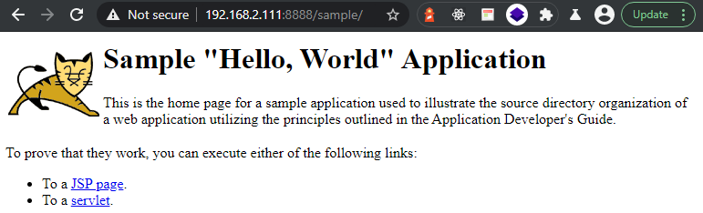

<!-- TOC -->

- [Docker Image](#docker-image)
    - [Sample Web Application](#sample-web-application)
    - [Running the Docker Images](#running-the-docker-images)
    - [Building the Docker Image](#building-the-docker-image)
- [Running a Cluster with Docker-Compose](#running-a-cluster-with-docker-compose)

<!-- /TOC -->


## Docker Image

You can download a version of Tomcat from [Docker Hub](https://hub.docker.com/_/tomcat?tab=tags&page=1&ordering=last_updated). I have been working with Tomcat 9 before - but I will try the [version 10](https://tomcat.apache.org/tomcat-10.0-doc/index.html) that is not yet labeled as stable:


```bash
docker pull tomcat:10-jdk11-corretto
```


### Sample Web Application


Tomcat offers a sample application that we can use with our container - [you can download it here](https://tomcat.apache.org/tomcat-10.0-doc/appdev/sample/). The example app has been packaged as a `sample.war` file. If you just want to browse the contents, you can unpack the war file with the jar command:


```bash
jar -xvf sample.war
```


The easiest way to run this application is simply to move the war file to your `CATALINA_BASE/webapps` directory. A default Tomcat install will automatically expand and deploy the application for you. You can view it with the following URL (assuming that you're running tomcat on port 8080 which is the default):


```bash
http://<My-Server>:8080/sample
```


### Running the Docker Images

To run the sample app in Docker copy the file onto your LINUX server and mount it into the Tomcat container:


```bash
docker run -it --rm -p 8888:8080 \
-v /opt/tomcat/docker/sample.war:/usr/local/tomcat/webapps/sample.war \
tomcat:10-jdk11-corretto

Using CATALINA_BASE:   /usr/local/tomcat
Using CATALINA_HOME:   /usr/local/tomcat
Using CATALINA_TMPDIR: /usr/local/tomcat/temp
Using JRE_HOME:        /usr/lib/jvm/java-11-amazon-corretto
Using CLASSPATH:       /usr/local/tomcat/bin/bootstrap.jar:/usr/local/tomcat/bin/tomcat-juli.jar
```


I forwarded the Tomcat service on port `8888` so I can now access the sample app under:


```bash
http://<My-Server>:8888/sample/
```





### Building the Docker Image

Alternatively, you can build the sample application into your container (so you don't need to use a volume mount). For this, create a Dockerfile next to the `sample.war` file:


```Dockerfile
FROM tomcat:10-jdk11-corretto
ADD sample.war /usr/local/tomcat/webapps/
EXPOSE 8080
CMD chmod +x /usr/local/tomcat/bin/catalina.sh
CMD ["catalina.sh", "run"]
```

And build and run your docker container from it:


```bash
docker build -t tomcat10 .
docker run -it -p 8888:8080 tomcat10
```


## Running a Cluster with Docker-Compose

__docker-compose.yml__

```yml
portal:
  image: nginx:stable-alpine
  ports:
   - "8888:80"
  volumes:
   - /opt/tomcat/docker/cluster/nginx/default.conf:/etc/nginx/conf.d/default.conf
  links:
   - tomcatOne:tomcat1
   - tomcatTwo:tomcat2
   - tomcatThree:tomcat3
tomcatOne:
  image: tomcat:10-jdk11-corretto
  volumes:
   - /opt/tomcat/docker/cluster/tomcat/conf/server.xml:/usr/local/tomcat/conf/server.xml
   - /opt/tomcat/docker/cluster/tomcat/conf/tomcat-users.xml:/usr/local/tomcat/conf/tomcat-users.xml
   - /opt/tomcat/docker/cluster/tomcat/webapps/sample.war:/usr/local/tomcat/webapps/sample.war
tomcatTwo:
  image: tomcat:10-jdk11-corretto
  volumes:
   - /opt/tomcat/docker/cluster/tomcat/conf/server.xml:/usr/local/tomcat/conf/server.xml
   - /opt/tomcat/docker/cluster/tomcat/conf/tomcat-users.xml:/usr/local/tomcat/conf/tomcat-users.xml
   - /opt/tomcat/docker/cluster/tomcat/webapps/sample.war:/usr/local/tomcat/webapps/sample.war
tomcatThree:
  image: tomcat:10-jdk11-corretto
  volumes:
   - /opt/tomcat/docker/cluster/tomcat/conf/server.xml:/usr/local/tomcat/conf/server.xml
   - /opt/tomcat/docker/cluster/tomcat/conf/tomcat-users.xml:/usr/local/tomcat/conf/tomcat-users.xml
   - /opt/tomcat/docker/cluster/tomcat/webapps/sample.war:/usr/local/tomcat/webapps/sample.war
```

__default.conf__

```conf
upstream backend  {
  server tomcat1:8080;
  server tomcat2:8080;
  server tomcat3:8080;
}

server {
    listen       80;
    server_name  localhost;

    #charset koi8-r;
    #access_log  /var/log/nginx/log/host.access.log  main;

    location / {
	proxy_pass  http://backend;
    }

    #error_page  404              /404.html;

    # redirect server error pages to the static page /50x.html
    #
    error_page   500 502 503 504  /50x.html;
    location = /50x.html {
        root   /usr/share/nginx/html;
    }
}

```